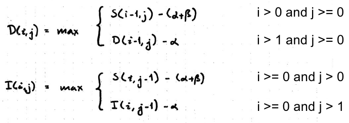

# Project 2

## Introduction
The scope of this project is to implement different types of gap costs for global alignment. I decided to implement a catch-all function, `global_pairwise_alignment`, which is capable of handling all different types of gap costs, including linear, affine and constant. I have implemented the function recursively, both for finding the optimal cost, as well as finding all possible alignments. The function works as intended, but I have not optimized finding the optimal cost to using linear space, using Hirschberg's idea. Additionally, since I have opted for finding all possible optimal alignments, instead of just one, the backtracking part of the function is rather slow.

## Method
The implementation of `global_pairwise_alignment` can be seen
<a href="https://github.com/ChristofferCJ/bioinfo/blob/main/project2/impl.py">here</a>.
The goal with my implementation was to make it as generic as possible, such that it can be used for all possible cost matrices and gap costs. To allow this, the signature of the function is defined as follows:
```py
def global_pairwise_alignment(
    a:          str,
    b:          str,
    c:          list[list[int]],
    gap:        Callable[[int], int],
    opt_method: str
    ):
```
The interesting part here is `c` and `gap`, which defines the cost matrix and gap cost respective. `c` is defined as a 2D array, allowing for all possible cost matrices. `gap` is defined as a function, taking one parameter of type `int` and returning an `int`. This allows specifying any kind of function of this signature, including constant, linear and affine gap costs.

### Computing optimal alignment
The inner function, `compute`, is used to calculate the optimal cost of alignment, as well as fill out the dynamic programming table for later use. This function is based on the recursion that is presented in the slides <a href="https://brightspace.au.dk/content/enforced/53951-LR8255/AiB_F2022_Slides/AffineGapcost.pdf">Global alignment with general affine gapcost</a>. Keeping the goal of genericness in mind, it is important to notice that handling affine gap costs is a more general problem than handling linear or constant gap costs, implying that the function works for these gap costs as well (in terms of complexity theory, we can say that linear and constant gap cost problems can be reduced to affine gap cost problems). \
To accompany this idea, my implementation differs slightly from the presented solution in the slides. More specifically, the slides states the recursion for insertion and deletion as follows:

Here, $\alpha$ and $\beta$ denotes the scalar and constant for affine gap costs respectively, which is of the form $\alpha * k + \beta$, where $k$ denotes the length of the gap. What is worth noting here, is that $k$ is implictly incremented by 1 in the last case of both definitions. My implementation expresses this explicitly, instead of implicitly is in the slides, to account for different types of gap costs: \
```python
if i >= 0 and j > 0:
    vals[0] = compute(i, j - 1) + gap(len)
if i >= 0 and j > 1:
    vals[1] = insert(i, j - 1, len + 1)
```